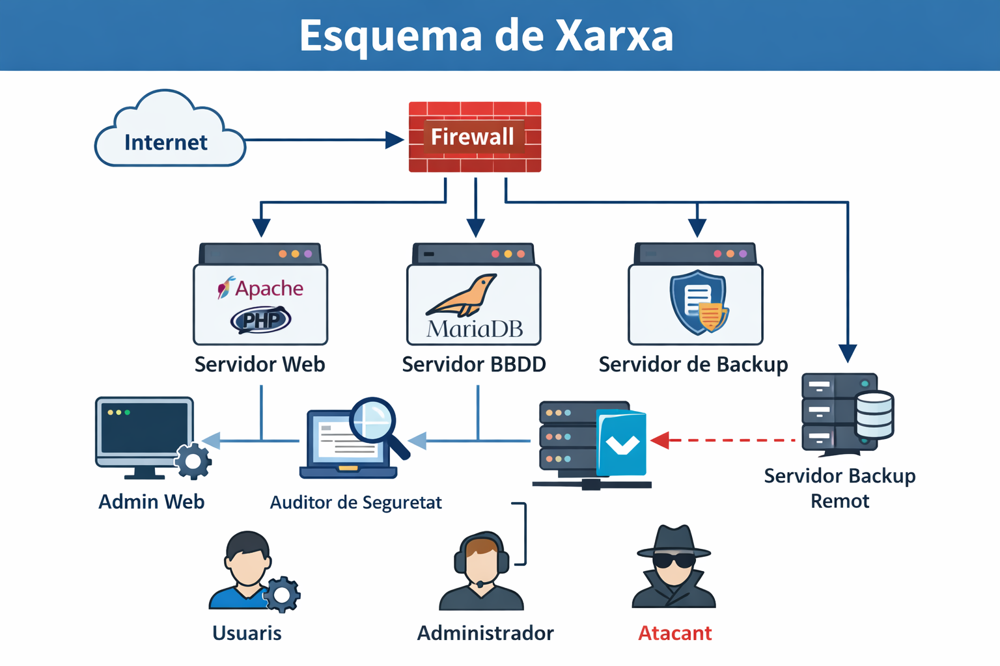

# Documentació Tècnica del Servidor Corporatiu

## Visió general
Aquest portal recull la documentació tècnica del desplegament d'un servidor corporatiu basat en serveis web, base de dades, gestió d'usuaris i mesures de seguretat.

L'objectiu és facilitar la comprensió, manteniment i revisió de la infraestructura per part de personal tècnic autoritzat.

## Equip responsable
Documentació elaborada per l'equip d'administració de sistemes del projecte SRE-Docs.

## Abast del projecte
Aquest lloc inclou:
- Configuració del servidor i instal·lació dels serveis
- Gestió d'usuaris i rols del sistema
- Mesures de seguretat aplicades al servidor
- Esquema general de la infraestructura

## Esquema de la xarxa

## Estructura de la documentació
- **Configuració**: instal·lació i verificació dels serveis del servidor
- **Gestió de rols**: usuaris creats, permisos i funcions
- **Seguretat**: accions de hardening i protecció del sistema